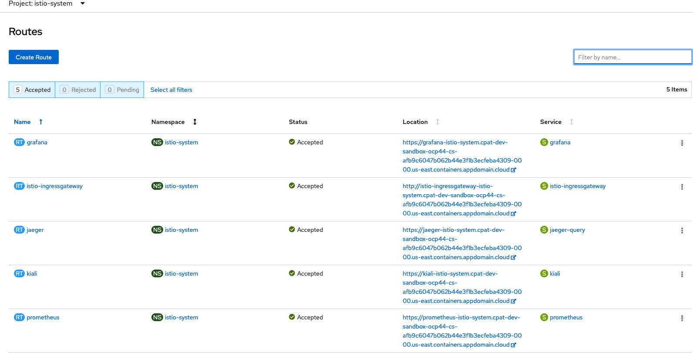

  # Up and Running with Red Hat Service Mesh - Istio (in 60 mn)
  # Cloud Pak Acceleration Team - Cloud Pak for Apps Chapter
  ### Nov 2020 - OmarG
  
  ## Table of Contents
  
  - [Objective](#objective)
  - [Prerequisites](#prerequisite)
  - [Introduction](#introduction)
  - [Installation](#installation)
  - [Deploying the Service Mesh Control Plane](#deploying-the-service-mesh-control-plane)
  - [Creating the Member Roll](#creating-the-member-roll)
  - [Blue-Green and Canary Deployments](#blue-green-and-canary-deployments)
  - [Dark Launch](#dark-launch)
  - [Metrics, Monitoring, and Tracing](#metrics-monitoring-and-tracing)
  - [OpenShift OOB Deployment Strategies](#openshift-oob-deployment-strategies)
  - [Learn more](#learn-more)


## Objective
- Show how to install Red Hat Service Mesh on OpenShift
- Show how to create a ServiceMeshControlPlane resource  and a ServiceMeshMemberRoll resource
- Show how to add blue-green, canary, dark launch deployment capabilities to an existing OCP applications
- Show how to use Kiali, Prometheus, Grafana, and Jaeger APM and Tracing APIs to visualize ane monitor a mesh of microservices
- Link to OpenShift OOB Deployment Strategies

## Prerequisites
- Basic knowledge of Red Hat Operators
- Basic knowledge of Service Mesh with Istio

## Introduction
 - Istio is an implementation of a service mesh. A service mesh is the connective tissue between your services that adds 
 additional capabilities like traffic control, service discovery, load balancing, resil‐ ience, observability, security, and so on.
 - The Istio service mesh is primarily composed of two major areas: the data plane and the control plane
   - The data plane for Istio service mesh is made up the istio-proxy, Layer 7 proxy, running as a sidecar container next to your application container. The data plane is implemented in such a way that it intercepts all inbound (ingress) and outbound (egress) network traffic.
   - The control plane is responsible for being the authoritative source for configuration and policy and security.
   
## Installation

To install the Red Hat OpenShift Service Mesh Operator, you must install 4 Operators in the order provided below. Log in to the OpenShift Container Platform web console as a user with the cluster-admin role, then Navigate to **Operators → OperatorHub**.

- **Elasticsearch:** Based on the open source Elasticsearch project that enables you to configure and manage an Elasticsearch cluster for tracing and logging with Jaeger.
  - Type Elasticsearch into the filter box to locate the Elasticsearch Operator.
  - Click the Elasticsearch Operator provided by Red Hat to display information about the Operator.
  - Click Install.
  - On the Install Operator page, select the A specific namespace on the cluster option and then select openshift-operators-redhat from the menu.
  - Select the Update Channel that matches your OpenShift Container Platform installation. For example, if you are installing on OpenShift Container Platform version 4.5, select the 4.5 update channel.
  - Select the Automatic Approval Strategy.
  - Click Install.
  - On the Installed Operators page, select the openshift-operators-redhat project. Wait until you see that the Elasticsearch Operator shows a status of "InstallSucceeded" before continuing.

- **Jaeger:** Based on the open source Jaeger project, lets you perform tracing to monitor and troubleshoot transactions in complex distributed systems.
  - Type Jaeger into the filter to locate the Jaeger Operator.
  - Click the Jaeger Operator provided by Red Hat to display information about the Operator.
  - Click Install.
  - On the Install Operator page, select All namespaces on the cluster (default). This installs the Operator in the default openshift-operators project and makes the Operator available to all projects in the cluster.
  - Select the stable Update Channel. This will automatically update Jaeger as new versions are released. If you select a maintenance channel, for example, 1.17-stable, you will receive bug fixes and security patches for the length of the support cycle for that version.
  - Select an Approval Strategy. You can select Automatic or Manual updates. If you choose Automatic updates for an installed Operator, when a new version of that Operator is available, the Operator Lifecycle Manager (OLM) automatically upgrades the running instance of your Operator without human intervention. If you select Manual updates, when a newer version of an Operator is available, the OLM creates an update request. As a cluster administrator, you must then manually approve that update request to have the Operator updated to the new version.
  - Click Install.
  - On the Subscription Overview page, select the openshift-operators project. Wait until you see that the Jaeger Operator shows a status of "InstallSucceeded" before continuing.

- **Kiali:** Based on the open source Kiali project, provides observability for your service mesh. By using Kiali you can view configurations, monitor traffic, and view and analyze traces in a single console.
  - Type Kiali into the filter box to find the Kiali Operator.
  - Click the Kiali Operator provided by Red Hat to display information about the Operator.
  - Click Install.
  - On the Install Operator page, select All namespaces on the cluster (default). This installs the Operator in the default openshift-operators project and makes the Operator available to all projects in the cluster.
  - Select the stable Update Channel.
  - Select the Automatic Approval Strategy.
  - Click Install.
  - The Installed Operators page displays the Kiali Operator’s installation progress.

- **Red Hat OpenShift Service Mesh:** Based on the open source Istio project, lets you connect, secure, control, and observe the microservices that make up your applications.
  - Type Red Hat OpenShift Service Mesh into the filter box to find the Red Hat OpenShift Service Mesh Operator.
  - Click the Red Hat OpenShift Service Mesh Operator to display information about the Operator.
  - On the Install Operator page, select All namespaces on the cluster (default). This installs the Operator in the default openshift-operators project and makes the Operator available to all projects in the cluster.
  - Click Install.
  - Select the stable Update Channel.
  - Select the Automatic Approval Strategy.
  - Click Install.
  - The Installed Operators page displays the Red Hat OpenShift Service Mesh Operator’s installation progress.

## Deploying the Service Mesh Control Plane
- Create a project named istio-system.
- Create the Control Plane:
  - Navigate to "Operators >> Installed Operators" and select istio-system from the "Project" menu.
  - Click the Red Hat OpenShift Service Mesh Operator. Under Provided APIs, the Operator provides links to create two resource types: a ServiceMeshControlPlane resource and a ServiceMeshMemberRoll resource
  - Under Istio Service Mesh Control Plane click Create ServiceMeshControlPlane.
   - On the Create Service Mesh Control Plane page, modify the YAML for the default ServiceMeshControlPlane template if/as needed.
   - Click Create to create the control plane. The Operator creates Pods, services, and Service Mesh control plane components based on your configuration parameters.
   - Click the Istio Service Mesh Control Plane tab.
   - Click the name of the new control plane.
   - Click the Resources tab to see the Red Hat OpenShift Service Mesh control plane resources the Operator created and configured.
- Make sure all pods have been created successfully
  - run
       
       ```oc get pods -n istio-system```
  - output should look like:
     
     
## Creating the Member Roll
- The ServiceMeshMemberRoll lists the projects belonging to the control plane. 
- Only projects listed in the ServiceMeshMemberRoll are affected by the control plane. 
- You must create a ServiceMeshMemberRoll resource named default in the same project as the ServiceMeshControlPlane.
- Steps to create a Member Roll:
  - Navigate to Operators → Installed Operators.
  - Click the Project menu and choose the project where your ServiceMeshControlPlane is deployed from the list (i.e. istio-system).
  - Click the Red Hat OpenShift Service Mesh Operator.
  - Click the All Instances tab.
  - Click Create New, and then select Create Istio Service Mesh Member Roll.
  - On the Create Service Mesh Member Roll page, modify the YAML to add your projects as members. 
    - You can add any number of projects.
    - A project can only belong to one ServiceMeshMemberRoll resource.
  - Click Create to save the Service Mesh Member Roll.
  - Example of member roll yaml:
  
    


## Blue-Green and Canary Deployments

**Deployment with Istio Injection**

my-customer-app-deployment-v1-and-v2.yaml

```yaml
apiVersion: apps/v1
kind: Deployment
metadata:
  labels:
    app: customer
    version: v1
  name: customer
spec:
  replicas: 1
  selector:
    matchLabels:
      app: customer
      version: v1
  template:
    metadata:
      labels:
        app: customer
        version: v1
      annotations:
        # LOOK HERE:
        sidecar.istio.io/inject: "true"
    spec:
      containers:
      - name: customer
        image: image-registry.openshift-image-registry.svc:5000/$NAMESPACE/customer:v1
        imagePullPolicy: Always
        ports:
        - containerPort: 8080

---

apiVersion: apps/v1
kind: Deployment
metadata:
  labels:
    app: customer
    version: v2
  name: customer
spec:
  replicas: 1
  selector:
    matchLabels:
      app: customer
      version: v2
  template:
    metadata:
      labels:
        app: customer
        version: v2
      annotations:
        # LOOK HERE:
        sidecar.istio.io/inject: "true"
    spec:
      containers:
      - name: customer
        image: image-registry.openshift-image-registry.svc:5000/$NAMESPACE/customer:v2
        imagePullPolicy: Always
        ports:
        - containerPort: 8080
```

**The Customer app Service**

my-customer-app-generic-service.yaml

```yaml
apiVersion: v1
kind: Service
metadata:
  name: customer-service
  labels:
    app: customer    
spec:
  ports:
  - name: http
    port: 8080
  selector:
    app: customer
```

**Istio Gateway to expose the Customer Service**

A Gateway describes a load balancer operating at the edge of the mesh receiving incoming or outgoing HTTP/TCP connections. The specification describes a set of ports that should be exposed, the type of protocol to use, SNI configuration for the load balancer, etc.
Since the customer service is the one users will interact with, we add a Gateway that exposes that endpoint.

my-customer-app-istio-gateway.yaml
```yaml
apiVersion: networking.istio.io/v1alpha3
kind: Gateway
metadata:
  name: customer-gateway
spec:
  selector:
    istio: ingressgateway # use istio default controller
  servers:
  - port:
      number: 80
      name: http
      protocol: HTTP
    hosts:
    - "*"
```

**DestinationRule**

A DestinationRule defines policies that apply to traffic intended for a service after routing has occurred.

my-customer-app-destinationrule-v1-v2.yaml

```yaml
apiVersion: networking.istio.io/v1alpha3
kind: DestinationRule
metadata:
    name: customer
spec:
    host: customer
    subsets:
    - name: version-v1
      labels:
        version: v1
    - name: version-v2
      labels:
        version: v2
```

**VirtualService**

A VirtualService defines a set of traffic routing rules to apply when a host is addressed. Each routing rule defines matching criteria for the traffic of a specific protocol. If the traffic is matched, then it is sent to a named destination service (or subset/version of it) defined in the registry.

my-customer-app-virtualservice-90-10.yaml
```yaml
apiVersion: networking.istio.io/v1alpha3
kind: VirtualService
metadata:
  name: customer-virtualservice
spec:
  hosts:
  - "*"
  gateways:
  - customer-gateway
  http:
  - match:
    - uri:
        prefix: /customer
    route:
    - destination:
        host: customer-service
        subset: version-v1
        port:
          number: 80
      weight: 90
    - destination:
        host: customer-service
        subset: version-v2
        port:
          number: 80
      weight: 10
```

## Dark Launch
A dark launch is a deployment to production that is invisible to customers. In this case, Istio allows you to duplicate or mirror traffic to a new version of your application and see how it behaves compared to the live application pod. This way you’re able to put production quality requests into your new service without affecting any live traffic.

```yaml
apiVersion: networking.istio.io/v1alpha3
kind: VirtualService
metadata:
  name: customer-virtualservice
spec:
  hosts:
  - "*"
  gateways:
  - customer-gateway
  http:
  - match:
    - uri:
        prefix: /customer
    route:
    - destination:
        host: customer-service
        subset: v1
    mirror:
        host: customer-service
        subset: v2
```
**Other Istio Resources**

- **ServiceEnrty:** enables adding additional entries into Istio’s internal service registry.
 ```yaml
apiVersion: networking.istio.io/v1alpha3
kind: ServiceEntry
metadata:
  name: google-egress-rule
spec:
  hosts:
  - www.google.com
  ports:
  - name: http-80
    number: 80
    protocol: http
```

## Metrics, Monitoring, and Tracing
### Prometheus
- Monitoring and alerting toolkit originally built at SoundCloud (2012). Now hosted by the CNCF Foundation (2016).
- Powered by a multi-dimensional data model with time series data identified by metric name and key/value pairs
- Provides PromQL, a flexible query language to leverage this dimensionality
- Supports multiple modes of graphing and dashboarding support: Grafana or other API consumers can be used to visualize the collected data.
### Grafana 
- Grafana is a technology used to compose observability dashboards with everything (Prometheus, logs, application data, etc.) 
### Jaeger
- Based on the open source Jaeger project.
- Distributed tracing system inspired by Google Dapper and OpenZipkin.
- OpenTracing compatible 
- Performs tracing to monitor and troubleshoot transactions in complex distributed systems.
- Released as open source by Uber.
### Kiali
- Based on the open source Kiali project 
- Observability console
- The management console for Istio-based service mesh.
- Provides observability for your service mesh: view configurations, monitor traffic, and view and analyze traces in a single console.

### Access to OCP the Service Mesh dashboards
- Click the Project menu and choose the project where your ServiceMeshControlPlane is deployed from the list (i.e. istio-system).
- From the Administrator View menu, select Network then routes: all routes will be displayed
  
- Kiali screen capture: In the following mesh, we have 3 microservices, **customer**, **preference** and **recommendation**. The 
*recommendation* service has 2 live deployments/versions, v1 and v2, both versions receive traffic/call from the **preference** service.
 

## OpenShift OOB Deployment Strategies
OOB OpenShift offers the Rolling / Canary,Custom, and Recreate deployment strategies. 
For more details, refer to: https://docs.openshift.com/container-platform/4.5/applications/deployments/deployment-strategies.html

## Learn More:
1. OSSM Install: https://docs.openshift.com/container-platform/4.5/service_mesh/v1x/preparing-ossm-installation.html
2. RH Istio Tutorial github: https://github.com/redhat-scholars/istio-tutorial
3. RH Istio Tutorial HTML (4 hour comprehensive workshop) : https://redhat-scholars.github.io/istio-tutorial/istio-tutorial/1.6.x/index.html
4. RH Istio presentation Deck: https://slidr.io/kameshsampath/sail-smoothly-in-the-cloud-an-introduction-to-istio#1
5. Download the ebook "Introducing Istio Service Mesh for Microservices" for FREE at https://developers.redhat.com/books/introducing-istio-service-mesh-microservices/.
6. A short blue-green tutorial: https://thenewstack.io/tutorial-blue-green-deployments-with-kubernetes-and-istio/
7. Another hands-on one hour blue-green workshop: https://github.com/RedHatWorkshops/openshiftv3-workshop/blob/master/9-Blue-Green-Deployments.adoc
8. Istio https://istio.io/docs/
9. Jaeger: https://www.jaegertracing.io/
10. Prometheus: https://prometheus.io/
11. Grafana: https://grafana.com/
12. Kiali: https://kiali.io/
13. OCP Deployment Strategies:  https://docs.openshift.com/container-platform/4.5/applications/deployments/deployment-strategies.html